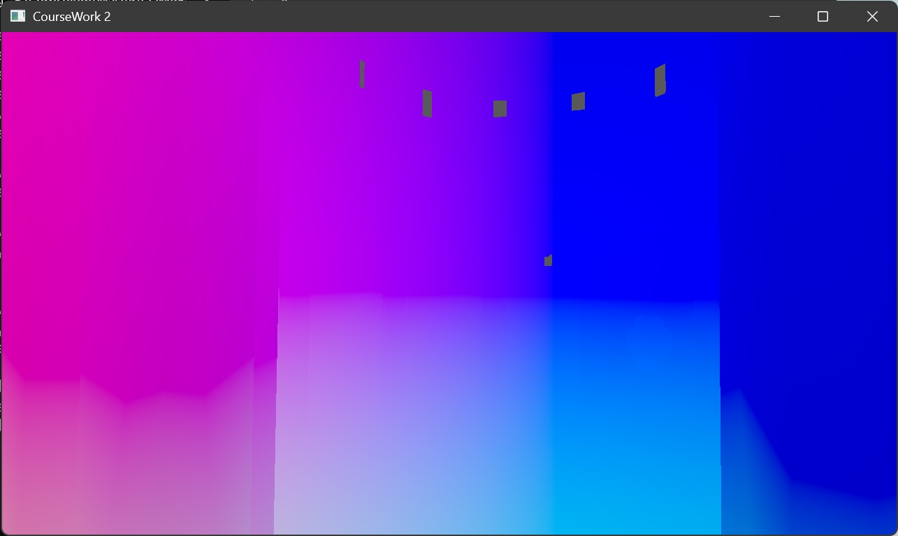

# Coursework 2 Report

COMP5822M High Performance Graphics 

Simiao Wang 201702881

May 2, 2024

## 1. Prep and Debug

### Choice of shading space

I choose world space as my shading space.

### Choice of descriptor set layout and descriptor bindings.

I have two descriptor set layouts, one is the scene descriptor set layout and the other is the object descriptor set layout.

In `create_scene_descriptor_layout`, it contains only a single uniform buffer binding, used for the vertex shader, and includes multiple important matrices and vector data related to the scene.

In `create_object_descriptor_layout`, it includes four descriptor bindings of the same type, each used for the fragment shader. They are for the base color texture, material color texture, roughness texture, and normal map.

### Describe uniform input data (e.g. UBOs and similar). 

`glm::mat4 camera`: Camera transformation matrix, defines the conversion from world space to view space.
`glm::mat4 projection`: Projection matrix, defines the conversion from view space to clipping space.
`glm::mat4 projCam`: The product of the projection matrix and camera matrix, directly used for the final transformation of vertex positions.
`glm::vec3 cameraPos`: Camera position, used for various visual effects calculations, such as lighting and parallax.
`glm::vec3 lightPos`: Light source position, crucial for calculating lighting and shadows.
`glm::vec3 lightCol`: Light source color, affects the lighting color and intensity of the scene.

### Screenshots

the normals:

view direction:

light direction:

## 2. Lighting

The shading effect of the PBR model is as follows:

Beckmann:

This result reflects the Beckmann normal distribution function, which is used to calculate how surface roughness affects the distribution of light reflection, simulating the scattering of light on rough surfaces, that is, the gloss and specular characteristics of the material surface.

Cook Torrance:

The brightness of the color indicates the intensity of the occlusion-shadow effect, where the brighter parts represent less occlusion and shadowing, and the darker parts indicate more occlusion and shadowing.

Fresnel:

Color variations typically transition from the material's base color to brighter or darker shades, indicating an increase in reflection intensity, especially at the edges and near grazing angles.

PBR specular term:

This indicates concentrated reflection of light at specific angles, with such highlights typically most apparent in areas directly illuminated by the light.

