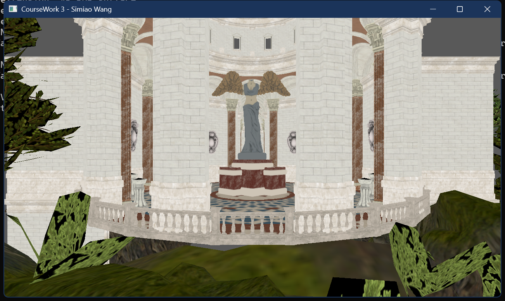
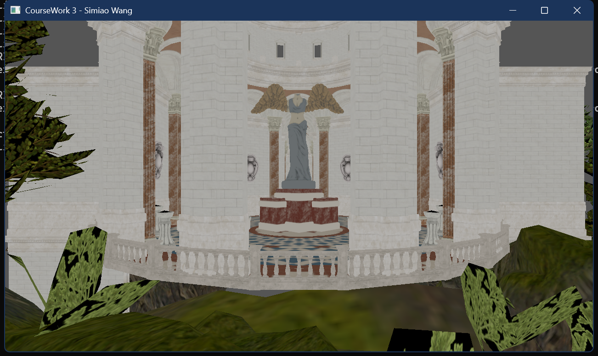

# Coursework 3 Report

COMP5822M High Performance Graphics 

Simiao Wang 201702881

May 13, 2024

## 1.1 Render-To-Texture Setup

**cbfencesA and cbfencesB**: These variables are objects used to create fences. They are created by calling the `lut::create_fence` function and are used during the subsequent command buffer recording and submission process.

**cbuffersA and cbuffersB**: These variables are objects used to record command buffers. Fences can be used to synchronize the execution of command buffers before submitting them.

**imageAvailable, renderFinished_Gbuffer, and renderFinished_Postprocessing**: These variables are objects used to create semaphores. They are created by calling the `lut::create_semaphore` function and are used during the subsequent command buffer recording and submission process.
```c++
lut::Semaphore imageAvailable = lut::create_semaphore(window);
lut::Semaphore renderFinished_Gbuffer = lut::create_semaphore(window);
lut::Semaphore renderFinished_Postprocessing = lut::create_semaphore(window);
```
**buffer_barrier**: The purpose of these memory barriers is to ensure that memory accesses between different stages are synchronized when uploading scene uniform variables to the uniform buffer, thereby preventing data conflicts and inconsistencies.

```c++
VkCommandBufferBeginInfo cmdBufferBeginInfo{};
cmdBufferBeginInfo.sType = VK_STRUCTURE_TYPE_COMMAND_BUFFER_BEGIN_INFO;
cmdBufferBeginInfo.flags = VK_COMMAND_BUFFER_RESET_RELEASE_RESOURCES_BIT;
cmdBufferBeginInfo.pInheritanceInfo = nullptr;

VkResult beginResult = vkBeginCommandBuffer(aCmdBuff, &cmdBufferBeginInfo);
if (beginResult != VK_SUCCESS) {
	throw std::runtime_error("Failed to start recording command buffer. Error code: " + std::to_string(beginResult));
}

lut::buffer_barrier(aCmdBuff,
	aSceneUBO,
	VK_ACCESS_UNIFORM_READ_BIT,
	VK_ACCESS_TRANSFER_WRITE_BIT,
	VK_PIPELINE_STAGE_VERTEX_SHADER_BIT,
	VK_PIPELINE_STAGE_TRANSFER_BIT
);
vkCmdUpdateBuffer(aCmdBuff, aSceneUBO, 0, sizeof(glsl::SceneUniform), &aSceneUniform);
lut::buffer_barrier(aCmdBuff,
	aSceneUBO,
	VK_ACCESS_TRANSFER_WRITE_BIT,
	VK_ACCESS_UNIFORM_READ_BIT,
	VK_PIPELINE_STAGE_TRANSFER_BIT,
	VK_PIPELINE_STAGE_VERTEX_SHADER_BIT
);
```

**Intermediate Texture Formats**: The intermediate texture format chosen is `VK_FORMAT_R16G16B16A16_SFLOAT`.

```c++
auto [vertexBuffer, vertexBufferView] = create_gbuffer(window, allocator, VK_FORMAT_R16G16B16A16_SFLOAT, flags);
...
```

## 1.2 Tone Mapping

在postprocessing的fullscreen.frag片元着色器中

```glsl
void main()
{
   vec3 color = texture(gTexColor, v2f_textureColor).rgb;
   vec3 toneMappedColor = color / (1.0 + color);
   //oColor = vec4(color, 1.0f);
   oColor = vec4(toneMappedColor, 1.0f); // Tone Mapping
}
```

before Tone Mapping:



After Tone Mapping:

